# BenefitsIQ

[](https://github.com/nookcreed/benefitsIQ/actions/workflows/ci.yml)

**Find the government benefits your family has already earned — in plain language, with zero hallucinated eligibility.** The LLM writes the conversation; a deterministic, auditable engine decides what you qualify for. Same inputs, same result, every time.

[**Live demo**](https://benefitsiq-app-7474659675348398.aws.databricksapps.com) · [**Demo video**](docs/demo-script.md)

---

## The problem

Every year, **over $60 billion in U.S. government benefits goes unclaimed** — SNAP, Medicaid, CHIP, WIC, LIHEAP, school meals. Not because families don't qualify, but because eligibility is fragmented across dozens of agencies, buried in bureaucratic language, and nobody tells you what you've left on the table.

A general chatbot can't fix this. Ask an LLM "do I qualify for SNAP?" and it will *guess* — confidently, and sometimes wrong. For a benefits decision, **a confident wrong answer is worse than no answer**: a family might skip applying for a program they actually qualify for, or waste time on one they don't.

---

## The solution: separate language from law

> **The LLM does language. The engine does eligibility. The model never decides whether you qualify.**

This is the core design decision and the reason BenefitsIQ can be trusted with a benefits answer:

| | Generic LLM chatbot | **BenefitsIQ** |
|---|---|---|
| **Decides eligibility** | The model guesses from training data | A **deterministic, auditable engine** evaluates real federal rules (FPL thresholds, gross/net income tests, categorical eligibility) for **8 programs**: SNAP, Medicaid, CHIP, WIC, LIHEAP, NSLP, TANF, and Section 8 Housing |
| **Wrong-answer risk** | Hallucinated programs and amounts | **Zero.** Eligibility is a pure function — same inputs always produce the same, explainable result |
| **Evidence** | None | Every program carries a **dollar estimate + agency citation** |
| **Personalization** | Generic advice | Privacy-safe **k-anonymous cohorts** ("families like you," floor of 30) powered by Census ACS data |
| **Output** | A wall of text | A structured, shareable **Statement of Benefits** you can print and take to an agency |

The LLM's *only* jobs are (1) turning messy conversation into a structured profile and (2) writing warm, human replies. Swap the model out and the eligibility results don't change — that's the point.

---

## Architecture

Two distinct paths, one app. The eligibility path is deterministic (no LLM in the loop). The how-to-apply path uses genuine RAG with citations.

```mermaid
flowchart TD
    subgraph Eligibility["Eligibility path — deterministic, zero hallucination"]
        U([User — plain English]) --> MS[Model Serving<br/>Llama 3.3 70B Instruct]
        MS -->|structured profile<br/>state, household, income| ENG[Deterministic<br/>Eligibility Engine<br/>server/engine/]
        ENG -->|reads rules, FPL,<br/>cohorts — sub-second| LB[(Lakebase<br/>serverless Postgres)]
        LB -.->|synced from| UC[(Unity Catalog<br/>Delta tables)]
        ENG --> SOB([Statement of Benefits<br/>programs · dollar value · citations<br/>+ families-like-you cohorts])
    end

    subgraph RAG["How-to-apply path — 3-tier retrieval-augmented generation"]
        Q([Question:<br/>How do I apply for SNAP?]) --> EMB[Model Serving<br/>GTE-Large 1024-dim]
        EMB -->|query embedding| VS{Vector Search<br/>index}
        VS -->|Tier 1| LB2[(Lakebase<br/>apply_kb_emb)]
        VS -.->|fallback: Tier 2| COS[In-process<br/>cosine similarity]
        COS -.->|fallback: Tier 3| LEX[Lexical<br/>keyword search]
        LB2 --> MS2[Model Serving<br/>Llama 3.3 70B]
        MS2 --> ANS([Cited answer<br/>grounded in retrieved context])
    end

    style Eligibility fill:#f0fdf4,stroke:#16a34a
    style RAG fill:#eff6ff,stroke:#2563eb
```



---

## Databricks stack — built end-to-end, not a wrapper

| Layer | Databricks capability | Role in BenefitsIQ |
|---|---|---|
| **App runtime** | **Databricks Apps** (AppKit / TypeScript + React) | Full-stack hosting, auth, plugin architecture |
| **Language model** | **Model Serving** — `databricks-meta-llama-3-3-70b-instruct` | Conversational profile extraction + human replies |
| **Embeddings** | **Model Serving** — `databricks-gte-large-en` (1024-dim) | Semantic retrieval over the how-to-apply knowledge base |
| **Source of truth** | **Unity Catalog** Delta tables (CDF enabled) | `programs`, `eligibility_rules`, `fpl_thresholds`, `cohort_stats`, `benefit_values`, `apply_kb`, `apply_kb_emb`, `acs_state_stats` |
| **Serving layer** | **Lakebase** synced tables (UC Delta to serverless Postgres) | Sub-second eligibility reads + vector retrieval — no warehouse spin-up |
| **Semantic search** | **Vector Search** index on `apply_kb` (with GTE-Large embedding) | Tier 1 retrieval for "How to apply" — falls back to in-process cosine, then lexical |
| **Operational store** | **Lakebase** Postgres (`app.impact_events`) | Live impact metrics |
| **Governance** | **Service principal** with least-privilege `SELECT` | End users need zero per-user OAuth consent |

**Datasets:**
- Curated U.S. federal program rules (USDA FNS, CMS, HHS, HUD, ACF) with source citations and effective dates
- Benefit dollar values (SNAP, WIC, CHIP, NSLP, TANF, Section 8) stored as data rows, not code (`benefit_values`)
- Cited how-to-apply knowledge base (`apply_kb`) + GTE-Large embeddings (`apply_kb_emb`) powering semantic RAG
- **U.S. Census ACS** poverty and SNAP-participation data enriching the "families like you" cohorts

---

## Add a program in 5 minutes — zero code changes

Programs, eligibility rules, and dollar values are **data** (rows in Unity Catalog), not code. Adding a new benefit program requires zero application changes:

| Step | What you do | Where |
|---|---|---|
| 1 | Insert a row into `programs` | Unity Catalog Delta |
| 2 | Insert eligibility rules (income thresholds, age gates, categorical tests) into `eligibility_rules` | Unity Catalog Delta |
| 3 | Insert dollar values into `benefit_values` | Unity Catalog Delta |
| 4 | Run `python scripts/uc_sync.py` | Syncs Delta to Lakebase |

That's it. The deterministic engine picks up the new program automatically because it reads rules from Lakebase at query time — no rebuild, no redeploy, no code change. The same applies to annual FPL updates, SNAP COLA adjustments, and state-level Medicaid threshold changes: update the data, re-sync, done.

This is why the system scales to all 50 states and new federal programs without engineering effort. **Rules are data. The engine is generic.**

---

## Data pipeline

All pipeline scripts live in `scripts/` and run with standard Python + Databricks CLI auth:

| Script | Purpose |
|---|---|
| `scripts/uc_load.py` | Load federal rules, programs, FPL thresholds into UC Delta tables (CDF enabled) |
| `scripts/uc_sync.py` | Sync UC Delta to Lakebase Postgres (run sequentially after load) |
| `scripts/acs_load.py` | Load U.S. Census ACS poverty/SNAP data into UC Delta |
| `scripts/acs_sync.py` | Sync ACS data to Lakebase |
| `scripts/acs_stub.py` | Generate stub ACS data for local development |
| `scripts/build_apply_kb.py` | Build the cited how-to-apply knowledge base from federal sources |
| `scripts/embed_apply_kb.py` | Embed KB chunks with GTE-Large (1024-dim) and sync to Lakebase |
| `scripts/load_benefit_values.py` | Load benefit dollar values (SNAP allotments, WIC, CHIP, NSLP) |
| `scripts/seed_db.py` | Seed local Lakebase for development |
| `scripts/seed_cohorts.py` | Seed cohort statistics for "families like you" |
| `scripts/seed_demo_impact.py` | Seed demo impact event data |
| `scripts/seed_demo_checks.py` | Seed demo eligibility checks |
| `scripts/seed_mlflow.py` | Seed MLflow tracking data for demo |

**Refresh cadence:** federal numbers change on a known schedule — FPL annually (January), SNAP allotments annually (October COLA), state Medicaid/CHIP limits roughly annually. Refresh = re-run the UC load + re-sync; **zero app downtime, zero code change** because rules and dollar values are data.

---

## Distribution strategy — how families actually find it

Building the tool is half the problem; reaching families is the other half. BenefitsIQ plugs into channels stressed families already touch:

- **211 / United Way** — 211 fields tens of millions of contacts/year. BenefitsIQ can be the screener their navigators run, or a warm-handoff link. The app already surfaces 211 for urgent help.
- **Community health centers and hospital social workers** — embed in intake/discharge workflows for a 60-second check instead of a 45-minute manual screen.
- **Schools and WIC clinics** — NSLP and WIC are natural touchpoints; a QR code on enrollment forms.
- **SNAP/Medicaid offices, libraries, food banks** — kiosk or QR at the places people already go.
- **The shareable Statement** — the Statement of Benefits is built to be printed and taken to an agency, so every user becomes a distribution point.
- **Caseworker mode (roadmap)** — one navigator screens many families; deterministic results + per-line citations make assisted screening defensible.

**Trust is the adoption lever.** Because eligibility is deterministic and every line is cited, partner organizations can put their name behind it — something they cannot do with a chatbot that might hallucinate a benefit.

---

## Scalability and cost

Cost scales with **usage**, not with an always-on footprint:

| Component | Driver | ~Cost / 1,000 families |
|---|---|---|
| Model Serving — Llama 3.3 70B (pay-per-token) | ~5 chat turns + 1 RAG answer = 8-12K tokens/family | ~$10-20 |
| Model Serving — GTE-Large embeddings | 1 query embedding/family (KB embedded once offline) | < $1 |
| Lakebase (serverless Postgres, 0.5-32 CU, scale-to-zero) | Millisecond reads; idle drops to 0 CU | ~$1-5 |
| Databricks App runtime | Small fixed compute | Negligible |
| **Total** | | **~$12-25 / 1,000 families (~1-3 cents each)** |

- **Scale-to-zero:** Lakebase drops to 0 CU between sessions — no idle spend.
- **Reads are cheap:** eligibility and retrieval hit Lakebase Postgres (milliseconds), not a SQL warehouse.
- **Linear, not stepped:** no fixed cluster to outgrow; doubling families roughly doubles token + CU spend.
- **Headroom:** 32 CU Lakebase + pay-per-token serving handles low-millions of checks/year; the next tier (managed Vector Search index, Genie for data exploration) is additive, not a rewrite.

> Cost figures are estimates; actual spend depends on your Databricks pricing tier and current Foundation Model rates.

---

## Project structure

```
server/
  engine/              # Pure deterministic eligibility logic (no I/O)
    eligibility.ts     #   evaluateProgram() — same inputs → same result
    eligibility.test.ts#   Unit tests proving the deterministic guarantee
    cohort.ts          #   k-anonymous "families like you" logic
    types.ts           #   Shared types (Profile, ProgramRow, RuleRow, FplRow)
  routes/
    chat.ts            # Conversational turn: LLM extracts profile + reply → runs engine
    benefits.ts        # Eligibility check over Lakebase synced tables + impact logging
    apply.ts           # RAG: semantic retrieval over KB → cited how-to-apply answers
    explain.ts         # Full deterministic trace (eligible AND ineligible, with reasons)
    catalog.ts         # UC metadata + live row counts (judge transparency)
    impact_seed.ts     # Impact event seeding
  server.ts            # createApp({ plugins: [lakebase(), serving(), server()] })
client/src/            # React UI: chat + animated Statement of Benefits + "families like you"
scripts/               # Data pipeline: UC load, sync, ACS, KB, embeddings (see table above)
docs/                  # Architecture notes, data sources, demo script
databricks.yml         # Asset Bundle (app + Lakebase resource)
app.yaml               # Runtime config (serving endpoints, Lakebase binding)
```

---

## Run it yourself

### Prerequisites
- Node.js 22+
- Databricks CLI (`databricks aitools install` for helper skills)
- Databricks workspace with Lakebase + Model Serving enabled

### 1. Configure
Edit `databricks.yml` and set your workspace + Lakebase resource names:
```yaml
targets:
  default:
    workspace:
      host: https://<your-workspace>.cloud.databricks.com
    variables:
      postgres_project: projects/<your-lakebase-project>
      postgres_branch:  projects/<your-lakebase-project>/branches/production
      postgres_database: projects/<your-lakebase-project>/branches/production/databases/databricks-postgres
```

### 2. Provision data (one time)
```bash
python scripts/uc_load.py              # Create UC Delta tables (CDF enabled)
python scripts/uc_sync.py              # Sync UC Delta → Lakebase Postgres
python scripts/build_apply_kb.py       # Build how-to-apply knowledge base
python scripts/embed_apply_kb.py       # Embed KB chunks with GTE-Large
python scripts/load_benefit_values.py  # Load benefit dollar values
```

### 3. Deploy
```bash
npm install
databricks bundle deploy               # Create app + Lakebase resource
databricks apps deploy benefitsiq-app
```

### Local development
```bash
cp .env.example .env                   # Set DATABRICKS_HOST + Lakebase connection
npm run dev                            # Hot-reload at the printed URL
```

### Quality gates
```bash
npm run typecheck && npm run lint      # tsc + appkit lint (strict)
npm test                               # Deterministic engine unit tests (vitest)
npm run build                          # Server + client bundles
```

---

## Tech stack

**Databricks:** Apps (AppKit), Lakebase (serverless Postgres + synced tables), Model Serving (Llama 3.3 70B + GTE-Large), Unity Catalog.
**App:** TypeScript, React, Vite, Express, Tailwind, shadcn/ui.

## License

MIT — see [LICENSE](./LICENSE).

---

*Built for the Databricks "AI for Good" Hackathon. BenefitsIQ provides eligibility estimates for informational purposes; final determinations are made by the administering agencies.*
